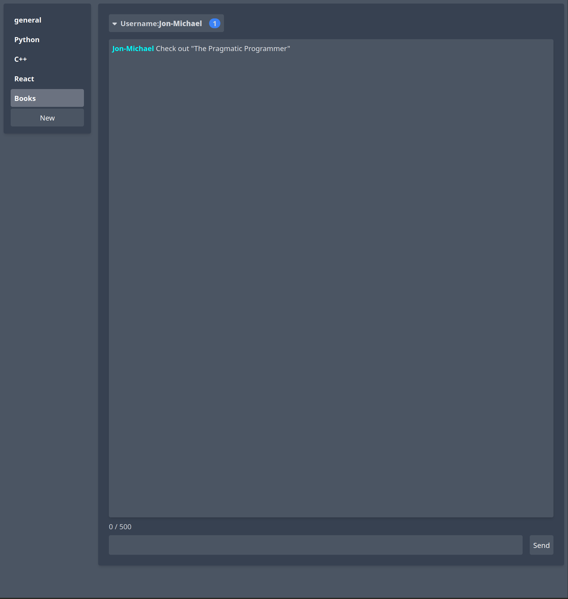

# Super Chat



Welcome to Super Chat, a dynamic and scalable chat application built with React, Golang, and Tailwind CSS. This application is designed to cater to a multitude of users simultaneously, with the flexibility to engage in various chat topics.

## Key Features

- **Real-time Chat**: Enjoy live conversations with real-time messaging capabilities.
- **Multiple Users**: Our robust infrastructure supports numerous users at any given time, ensuring a smooth and responsive experience.
- **Versatile Topics**: Create and participate in multiple chat topics, tailored to your community's interests.
- **Ongoing Development**: Super Chat is actively being improved with new features and refinements.

## Tech Stack

- **Frontend**: Built with React for a responsive user interface, styled with Tailwind CSS for a modern look.
- **Backend**: Powered by Golang, offering efficient performance and concurrency support.
- **Containerization**: Utilizes Docker for easy building and deployment, ensuring consistency across environments.

## Getting Started

To get Super Chat up and running on your local machine for development and testing purposes, follow these instructions:

### Prerequisites

- Docker
- Docker Compose

### Running the Application

1. Clone the repository to your local machine.
2. Navigate to the cloned directory.
3. Run the following command:

```bash
docker-compose up
```


This will bring up the application and it can be accessed at http://localhost:8080/


### Deployment

Super Chat includes a Terraform script for deployment. To deploy the application to AWS ec2 `cd infra` and use `terraform apply` to bring up the infrastructure

### Contributions
As Super Chat is still under active development, contributions are welcome. Please feel free to fork the repository, make your changes, and submit a pull request.
